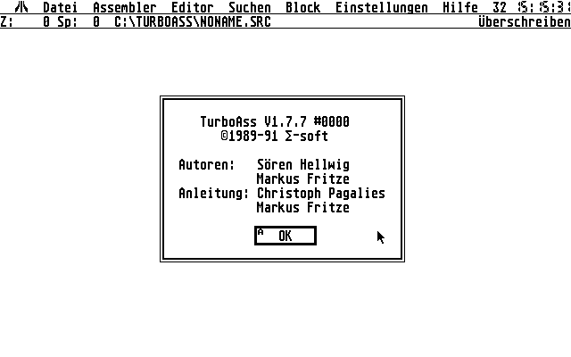
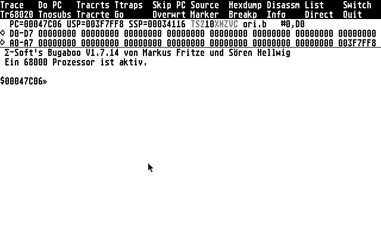
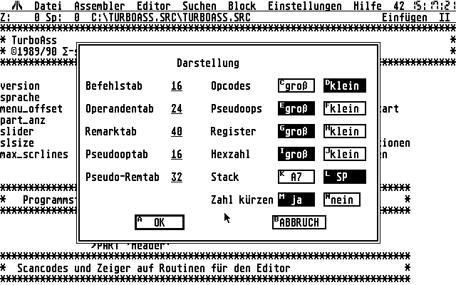
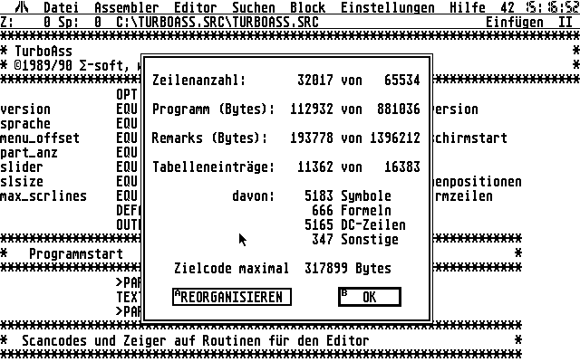
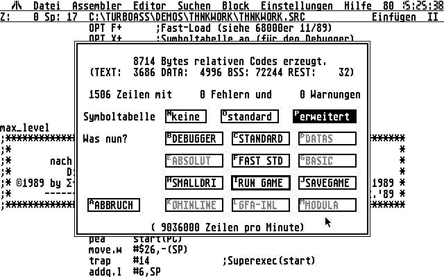
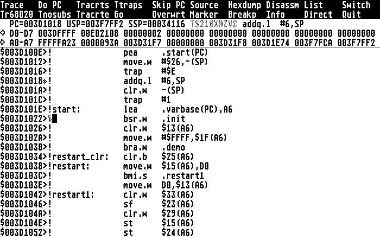

# Atari ST TurboAss / Bugaboo

This is a collection of the old code base for the TurboAss and Bugaboo, which was first sold commercially under the name OMIKRON.Assembler and later as shareware under the name TurboAss/Bugaboo.

Features:

  * 68000 assembler, editor and debugger
  * Compiles up to 1.3 million lines per minute (on a 8MHz 68000)
  * Syntax check at input!
  * very powerful editor
  * source level debugging
  * does not depend on the operating system

TurboAss Start
--------------

Bugaboo Start
-------------

TurboAss Settings
-----------------

TurboAss Source Info
--------------------

TurboAss Assembly
-----------------

(The "lines per minute" is about 8x higher than on an 8MHz Atari ST, because I did this screenshot in an emulator inside Virtual PC)

Bugaboo source view
-------------------

If somebody is still interested, here are the old files. This repository contains the following blobs:
- TurboAss.asm is the text source of the editor/assembler.
- Bugaboo.asm is the text source of the debugger.
- turboass_german_short_manual.txt is the short manual (German) for the applications. The 240 page printed manual (in TeX) is lost, but a PDF scan of the OMIKRON.Assembler manual is part of this repository.
- TURBOASS.LZH is the original distribution, which were files copied onto a floppy disk
- TA_SRC.LZH is the source dump of TurboAss (in uncompressed it is the "TurboAss Source code" folder - this allows you to look into the archive online)
- BUG_SRC.LZH is the source dump of the Bugbaboo (in uncompressed it is in the "BUGABOO" folder - this allows you to look into the archive online)

Files with the extension .SRC are binary files in the format of the TurboAss. The documentation for the file format is part of the TurboAss source code
